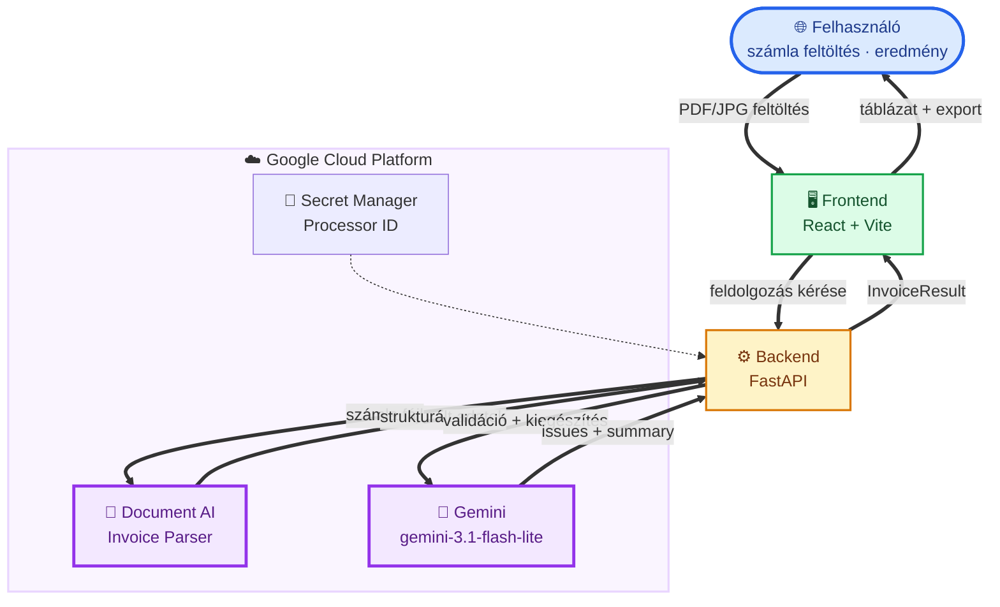
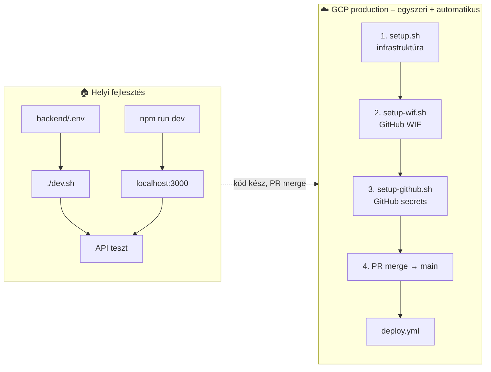
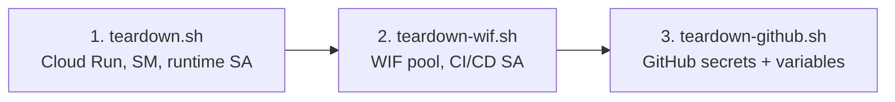

# Intelligens Számlafeldolgozó

PDF és képfájl alapú számlák automatikus feldolgozása a **Google Cloud Document AI Invoice Parser** és a **Gemini API** kombinációjával. A rendszer strukturált adatokat nyer ki, validál, könyvelői értékelést készít, és exportál PDF / XLSX / CSV formátumban.

## Tartalom

1. [Gcloud telepítés](#gcloud-telepítés)
2. [Általános ismerető](#általános-ismerető)
3. [Skálázható felhő alapú megoldás](#skálázható-felhő-alapú-megoldás)

---

## Gcloud telepítés

Gyors útmutató a GCP-re való telepítéshez. Részletek alább a [Skálázható felhő alapú megoldás](#skálázható-felhő-alapú-megoldás) szekcióban.

**Előfeltételek:** `gcloud` CLI, `gh` CLI, GCP projekt számlázással.

### 1. Document AI processzor létrehozása

[GCP Console → Document AI](https://console.cloud.google.com/ai/document-ai) → **Create Processor** → **Invoice Parser** → régió: **`eu`**

Másold ki a **Processor ID**-t – a következő lépésben kell.

### 2. Környezeti változók beállítása

```bash
export GCP_PROJECT_ID=<a-gcp-projekt-id>
export GCP_PROCESSOR_ID=<a-processzor-id>
export GCP_REGION=europe-west1
export BACKEND_SERVICE=invoice-processor-backend
export FRONTEND_SERVICE=invoice-processor-frontend
export GITHUB_REPO=<szervezet>/<repo-nev>
```

### 3. Bejelentkezés GCP-be

```bash
gcloud auth login
gcloud auth application-default login
```

### 4. Aktuális projekt beállítása

```bash
gcloud config set project "${GCP_PROJECT_ID}"
gcloud auth application-default set-quota-project "${GCP_PROJECT_ID}"
```

### 5. Infrastruktúra telepítése

```bash
./scripts/setup.sh
```

A script a `GCP_PROCESSOR_ID` környezeti változót Secret Manager-be menti, majd kiírja a Cloud Run URL-eket.

### 6. GitHub Actions hitelesítés (WIF)

```bash
./scripts/setup-wif.sh
```

### 7. GitHub Secrets és Variables

```bash
gh auth login
./scripts/setup-github.sh
```

A script kilistázza a beállítandó secrets/variables értékeket, majd kérdez: `Folytatod a beallitast? [y/N]` → nyomj **`y`**, Enter.

### 8. Alkalmazás deploy

1. GitHub repó → **Pull requests** → **New pull request** → **Create pull request**
2. **Merge** a PR-t a `main` branchre

A GitHub Actions automatikusan deployol – pár perc múlva él az alkalmazás. Követés: **Actions** → **Deploy**.

### 9. Tesztelés

1. Nyisd meg a frontend weboldalt a böngészőben. Az URL-t a `setup.sh` a végén kiírja, vagy a GCP Console → **Cloud Run** → `invoice-processor-frontend` → **URL**.
2. Tölts fel egy tesztszámlát az [`invoices/`](invoices/) mappából (pl. `01_helyes_alap.pdf`), indítsd el a feldolgozást, és nézd meg az eredményt.

### 10. Erőforrások törlése (demo újraindítás)

```bash
./scripts/teardown.sh
./scripts/teardown-wif.sh
./scripts/teardown-github.sh
```

---

## Általános ismerető

A teljes alkalmazás **Document AI + Gemini** pipeline-t használ:

1. **Document AI** – strukturált adatkinyerés (partner, összegek, dátumok, tételek)
2. **Gemini** – hiányzó mezők pótlása, ÁFA-validáció, anomália-detektálás, könyvelői értékelés
3. **Export** – PDF / XLSX / CSV / könyvelői adatlap

---

## Skálázható felhő alapú megoldás

Ez a repository **production-ready** megoldást ad: React frontend, FastAPI backend, Document AI + Gemini integráció, Cloud Run deploy és GitHub Actions CI/CD.

### Architektúra

#### Magas szintű áttekintés



### Architektúra komponensek

| Komponens | Technológia | Felelősség |
|-----------|-------------|------------|
| **Frontend** | React, Vite, TailwindCSS | Fájlfeltöltés, eredmény táblázat, export gombok |
| **Backend** | FastAPI, uvicorn | Upload, batch feldolgozás, Document AI + Gemini orchestration |
| **Document AI** | Invoice Parser (`eu`) | Strukturált adatkinyerés számlákból |
| **Gemini API** | `gemini-3.1-flash-lite` (Vertex AI, global) | Validáció, mezőpótlás, könyvelői értékelés – **ADC, nincs API kulcs** |
| **Cloud Run** | Source deploy (buildpacks) | Skálázható futtatás HTTPS-sel |
| **Secret Manager** | GCP titkok | Document AI Processor ID |
| **GitHub Actions** | `lint.yml`, `deploy.yml` | Lint PR-en, deploy `main`-en (WIF, kulcs nélkül) |

### API végpontok

| Végpont | Metódus | Leírás |
|---------|---------|--------|
| `/health` | GET | Health check – `{"status": "ok"}` |
| `/api/upload` | POST | Több fájl feltöltése (multipart) |
| `/api/process` | POST | Batch feldolgozás indítása |
| `/api/process/{job_id}` | GET | Feldolgozás állapota és eredmények |
| `/api/export/pdf` | POST | PDF riport letöltése |
| `/api/export/xlsx` | POST | XLSX export |
| `/api/export/csv` | POST | CSV export |
| `/api/export/xlsx-accounting` | POST | Könyvelői adatlap (fix oszlopszerkezet) |

### Előfeltételek

| Eszköz | Miért kell? |
|--------|-------------|
| **Node.js** 20+ | Frontend futtatásához és buildhez |
| **uv** ([telepítés](https://docs.astral.sh/uv/)) | Backend függőségek kezelése |
| **gcloud CLI** | GCP infrastruktúra (`setup.sh`) és helyi ADC auth |
| **GCP projekt** | Document AI + Cloud Run + Secret Manager |

### Telepítési áttekintés

| Környezet | Cél | Hogyan telepítünk? |
|-----------|-----|---------------------|
| **Helyi (fejlesztői gép)** | Gyors fejlesztés, hibakeresés | Kézzel: `uv` + `npm run dev` |
| **GCP (production)** | Demo, valódi felhasználók | Automatikusan: **GitHub Actions** (`deploy.yml`) |



#### Ki mit csinál?

| Lépés | Eszköz | Mit telepít? | Gyakoriság |
|-------|--------|--------------|------------|
| Infrastruktúra (API-k, SA, Secrets, üres Cloud Run) | `scripts/setup.sh` | GCP erőforrások – **nem** az alkalmazás kódját | Egyszer, projekt elején |
| GitHub Actions WIF | `scripts/setup-wif.sh` | Kulcs nélküli CI hitelesítés | Egyszer, `setup.sh` után |
| GitHub Secrets + Variables | `scripts/setup-github.sh` | Repository secrets/variables (`gh` CLI) | Egyszer, `setup-wif.sh` után |
| Alkalmazás kód | **GitHub Actions** `deploy.yml` | Forráskód → Cloud Run | `main`-re merge után |
| Lint ellenőrzés | GitHub Actions `lint.yml` | Kódminőség PR-en | Minden pull request |
| Demo törlése (GCP) | `scripts/teardown.sh` → `teardown-wif.sh` | Cloud Run, Secret Manager, SA, WIF | Demo újraindításkor |
| Demo törlése (GitHub) | `scripts/teardown-github.sh` | Repository secrets + variables | `teardown-wif.sh` után |

> **Fontos:** A Cloud Run-ra való telepítés **alapértelmezetten a GitHub Actions-szel történik**. A `setup.sh` csak az infrastruktúrát készíti elő.

### Helyi telepítés és tesztelés

#### 1. Backend

```bash
cd backend
cp .env.example .env
```

Állítsd be a `.env` fájlban:

```env
GCP_PROJECT_ID=<a-gcp-projekt-id>
GCP_LOCATION=eu
GCP_PROCESSOR_ID=<document-ai-processor-id>
GEMINI_MODEL=gemini-3.1-flash-lite
GEMINI_LOCATION=global
CORS_ORIGINS=http://localhost:3000
```

```bash
set -a; source .env; set +a
gcloud auth application-default login
gcloud config set project "${GCP_PROJECT_ID}"
gcloud auth application-default set-quota-project "${GCP_PROJECT_ID}"
uv sync
./dev.sh
```

> **Nincs `GEMINI_API_KEY`!** A Gemini a **Vertex AI**-on fut Application Default Credentials-sel (ADC), ugyanúgy mint a contract-analyzer projektben. Helyben: `gcloud auth application-default login`. Cloud Run-on: a `invoice-processor-sa` service account (`roles/aiplatform.user`).

**Health check:**

```bash
curl http://localhost:8000/health
# {"status":"ok"}
```

| Hiba | Ok |
|------|-----|
| `ValidationError` induláskor | `.env` nincs kitöltve |
| Document AI hiba | Hiányzó ADC vagy `roles/documentai.apiUser` |
| Gemini timeout | Nincs ADC, vagy hiányzó `roles/aiplatform.user` |

#### 2. Frontend

```bash
cd frontend
cp .env.example .env
npm install
npm run dev
```

Nyisd meg: [http://localhost:3000](http://localhost:3000)

> Fejlesztés közben a Vite proxy a `/api/*` kéréseket a `http://localhost:8000` backend felé irányítja.

#### 3. Lint ellenőrzés

```bash
cd backend && uv sync --group dev && uv run ruff check .
cd frontend && npm install && npm run lint && npm run build
```

### GCP telepítés és tesztelés

> **Gyors útmutató:** A lépések rövid összefoglalója a [Gcloud telepítés](#gcloud-telepítés) szekcióban.

#### Telepítési sorrend (ajánlott)

```
0. Document AI processzor  →  Console: Invoice Parser (eu)
1. setup.sh                →  GCP infrastruktúra (GCP_PROCESSOR_ID környezeti változóból)
2. setup-wif.sh            →  GitHub Actions WIF (egyszer, JSON kulcs nélkül)
3. setup-github.sh         →  GitHub Secrets + Variables (gh CLI)
4. PR merge → main         →  alkalmazás deploy (automatikus, pár perc)
5. tesztelés               →  weboldal + invoices/ feltöltés
```

#### 0. Document AI processzor

1. [GCP Console → Document AI](https://console.cloud.google.com/ai/document-ai) → **Create Processor** → **Invoice Parser** → régió: **`eu`**
2. Másold ki a **Processor ID**-t:

```bash
export GCP_PROCESSOR_ID=<a-processzor-id>
```

#### 1. Infrastruktúra – `setup.sh`

```bash
export GCP_PROJECT_ID=<a-gcp-projekt-id>
export GCP_PROCESSOR_ID=<a-processzor-id>
./scripts/setup.sh
```

A script a `GCP_PROCESSOR_ID` környezeti változót Secret Manager-be menti. A végén kiírja a **Cloud Run URL-eket** (GCP konzollal egyező formátum) és copy-paste-elhető `export` parancsokat:

```text
export GCP_PROJECT_ID=...
export GCP_REGION=europe-west1
export BACKEND_SERVICE=invoice-processor-backend
export FRONTEND_SERVICE=invoice-processor-frontend
```

> **Gemini:** nincs külön API kulcs – a runtime service account (`invoice-processor-sa`) hívja a Vertex AI-t ADC-vel.

#### 2. GitHub Actions hitelesítés – WIF

```bash
export GCP_PROJECT_ID=<a-gcp-projekt-id>
export GITHUB_REPO=<szervezet>/<repo-nev>
./scripts/setup-wif.sh
```

A script a végén kiírja a **GitHub Secrets** értékeket (manuális beállításhoz). Automatikus beállításhoz futtasd a **`setup-github.sh`** scriptet a WIF setup után (lásd alább).

Ha a `setup.sh` már lefutott, a **`VITE_API_BASE_URL`** is megjelenik (a backend placeholder Cloud Run URL-je – ez megegyezik a GCP konzollal):

```text
https://invoice-processor-backend-<PROJECT_NUMBER>.europe-west1.run.app
```

> **Megjegyzés:** A `gcloud run services describe --format='value(status.url)'` régi `*.a.run.app` címet adhat vissza; a setup scriptek a konzollal egyező `*.REGION.run.app` formátumot használják.

| Service account | Szerep |
|-----------------|--------|
| `invoice-processor-sa` | App futtatás, Document AI, Vertex AI (Gemini), Secret Manager olvasás |
| `invoice-processor-cicd-sa` | Deploy GitHub Actions-ből (WIF) |

#### 3. GitHub Secrets és Variables – `setup-github.sh`

A WIF és a Cloud Run placeholder service-ek után a repository secrets/variables értékeit a **`gh` CLI** állítja be:

```bash
export GCP_PROJECT_ID=<a-gcp-projekt-id>
export GITHUB_REPO=<szervezet>/<repo-nev>   # opcionális, ha a repo gyökeréből futtatod
./scripts/setup-github.sh
# vagy megerősítés nélkül: ./scripts/setup-github.sh --yes
# csak secrets (variables nélkül): ./scripts/setup-github.sh --secrets-only
```

| Előfeltétel | Leírás |
|-------------|--------|
| `setup.sh` + `setup-wif.sh` | Már lefutott |
| `gh auth login` | Repo admin jog kell |
| `GITHUB_REPO` | Automatikusan felismeri, ha a klónból fut |

A script a GCP-ből számolja ki a WIF provider és CI/CD SA értékeket; a backend URL-t a Cloud Run service alapján. A variables alapértelmezései megegyeznek a `deploy.yml`-ével – felülírhatók környezeti változókkal (pl. `GEMINI_MODEL=...`).

A végén megjelenik a beállítandó variables listája és a kérdés: `Folytatod a beallitast? [y/N]` → nyomj **`y`**, Enter. (Automatikus folytatás: `./scripts/setup-github.sh --yes`.)

Manuális beállítás is lehetséges (Settings → Secrets and variables → Actions). A demo végén a [`teardown-github.sh`](#6-erőforrások-törlése-demo-újraindítás) törli ezeket.

**GitHub Secrets:**

| Secret | Leírás |
|--------|--------|
| `GCP_PROJECT_ID` | GCP projekt azonosító |
| `GCP_WIF_PROVIDER` | WIF provider teljes resource neve |
| `GCP_WIF_SERVICE_ACCOUNT` | `invoice-processor-cicd-sa@...` e-mail |
| `VITE_API_BASE_URL` | Backend Cloud Run URL – a `setup.sh` után elérhető |

**GitHub Variables** (opcionális – a `setup-github.sh` alapértelmezésekkel beállítja):

| Variable | Alapértelmezés |
|----------|----------------|
| `GCP_LOCATION` | `eu` |
| `GEMINI_MODEL` | `gemini-3.1-flash-lite` |
| `GEMINI_LOCATION` | `global` |
| `MAX_FILE_SIZE_MB` | `20` |
| `MAX_FILES_PER_BATCH` | `10` |
| `UPLOAD_DIR` | `/tmp/invoices` |
| `CORS_ORIGINS` | `*` |

#### 4. Alkalmazás deploy – GitHub Actions

1. GitHub repó → **Pull requests** → **New pull request** → **Create pull request**
2. **Merge** a PR-t a `main` branchre

A GitHub Actions automatikusan deployol (pár perc). Követés: **Actions** → **Deploy**.

#### 5. GCP tesztelés

1. Nyisd meg a frontend weboldalt a böngészőben. Az URL: GCP Console → **Cloud Run** → `invoice-processor-frontend` → **URL** (a `setup.sh` is kiírja a végén).
2. Tölts fel egy tesztszámlát az [`invoices/`](invoices/) mappából, indítsd el a feldolgozást, és nézd meg az eredményt. Melyik fájl mire való: [`invoices/README.md`](invoices/README.md).

> Az első deploy után a valódi alkalmazás jelenik meg; a `setup.sh` placeholder image-jén még a Cloud Run „Congratulations” oldal látszik.

#### 6. Erőforrások törlése (demo újraindítás)

A setup lépések **fordított sorrendben** futtatandók: először a GCP runtime, majd a CI/CD WIF, végül a GitHub repó beállításai.



**1–2. GCP erőforrások** (`gcloud` CLI):

```bash
export GCP_PROJECT_ID=<a-gcp-projekt-id>
export GITHUB_REPO=<szervezet>/<repo-nev>
./scripts/teardown.sh
./scripts/teardown-wif.sh
```

| Script | Mit töröl? |
|--------|------------|
| `teardown.sh` | Cloud Run service-ek, Secret Manager titkok, runtime service account (`invoice-processor-sa`) |
| `teardown-wif.sh` | WIF pool + provider, CI/CD service account (`invoice-processor-cicd-sa`), deploy IAM |

**3. GitHub repó beállítások** (`gh` CLI):

```bash
export GITHUB_REPO=<szervezet>/<repo-nev>   # opcionális, ha a repo gyökeréből futtatod
./scripts/teardown-github.sh
# vagy megerősítés nélkül: ./scripts/teardown-github.sh --yes
```

| Előfeltétel | Leírás |
|-------------|--------|
| `gh` CLI | [Telepítés](https://cli.github.com/) |
| `gh auth login` | Bejelentkezés, repo admin jog kell |
| `GITHUB_REPO` | `org/repo` formátum – automatikusan felismeri, ha a repó klónjából fut |

A script **csak a létező** értékeket törli (idempotens). A `--yes` kapcsoló vagy `AUTO_YES=true` kihagyja az interaktív megerősítést.

**Törölt GitHub Secrets:**

| Secret | Megjegyzés |
|--------|------------|
| `GCP_PROJECT_ID` | Setup során beállítva |
| `GCP_WIF_PROVIDER` | WIF provider resource név |
| `GCP_WIF_SERVICE_ACCOUNT` | CI/CD SA e-mail |
| `VITE_API_BASE_URL` | Backend Cloud Run URL |
| `GCP_WORKLOAD_IDENTITY_PROVIDER` | Régi név (ha még létezik) |
| `GCP_SERVICE_ACCOUNT` | Régi név (ha még létezik) |

**Törölt GitHub Variables** (ha be lettek állítva):

| Variable | Alapértelmezés a `deploy.yml`-ben |
|----------|-----------------------------------|
| `GCP_LOCATION` | `eu` |
| `GEMINI_MODEL` | `gemini-3.1-flash-lite` |
| `GEMINI_LOCATION` | `global` |
| `MAX_FILE_SIZE_MB` | `20` |
| `MAX_FILES_PER_BATCH` | `10` |
| `UPLOAD_DIR` | `/tmp/invoices` |
| `CORS_ORIGINS` | `*` |

> **Megjegyzés:** A teljes demo újraindításhoz a fenti három script sorrendben futtatandó, majd újra `setup.sh` → `setup-wif.sh` → `setup-github.sh` → PR merge `main`-re.

### Működik-e?

| Réteg | Állapot | Megjegyzés |
|-------|---------|------------|
| Frontend build + lint | ✅ | Független a GCP-től |
| Backend lint | ✅ | Független a GCP-től |
| `/health` helyben | ✅ | GCP konfiguráció nélkül is |
| Számla feldolgozás helyben | ⚠️ GCP kell | ADC + Document AI processzor + `roles/aiplatform.user` |
| GCP deploy | ⚠️ CI-vel | `setup.sh` + `setup-wif.sh` + `setup-github.sh` + PR merge `main`-re |

### Projekt struktúra

```
trn-gcp-ai-invoice-management/
├── backend/           # FastAPI backend (main.py, dev.sh, pyproject.toml)
│   ├── .env.example   # Backend környezeti változók sablonja
│   ├── routers/       # upload, process, export
│   ├── services/      # document_ai, gemini, processor, exporter
│   └── models/        # Pydantic adatmodellek
├── frontend/          # React + Vite UI
│   └── .env.example   # Frontend (Vite) környezeti változók sablonja
├── invoices/          # Fiktív demó számlák (PDF, JPG)
├── scripts/           # setup*.sh, lib.sh, teardown*.sh
├── .github/workflows/ # lint.yml, deploy.yml
```

### Demo forgatókönyv

A fiktív tesztszámlák az [`invoices/`](invoices/) mappában vannak. Részletes leírás: [`invoices/README.md`](invoices/README.md).

| Fájl | Leírás | Elvárt eredmény |
|------|--------|-----------------|
| `szamla_ok_hu.pdf` | Szabályos magyar PDF számla | ✅ Minden mező kijön |
| `szamla_kezzel_irt.jpg` | Kézzel írt, **adószám nélkül** | ❌ Gemini hibát jelez |
| `szamla_ok_en.pdf` | Szabályos angol PDF számla | ✅ Angol mezők is mappelve |
| `szamla_afa_hiba.pdf` | ÁFA / végösszeg számítás hibás | ⚠️ Gemini figyelmeztetést jelez |

**Batch demo:** Töltsd fel mind a négy fájlt egyszerre → összesített táblázat → riport → export.

---

## Technológiai stack

| Réteg | Technológia |
|-------|-------------|
| Frontend | React 18 + Vite + TailwindCSS |
| Backend | Python 3.12 + FastAPI |
| AI – Kinyerés | Google Cloud Document AI (Invoice Parser) |
| AI – Validáció | Google Gemini API / Vertex AI (`gemini-3.1-flash-lite`, ADC) |
| Deployment | Google Cloud Run (source deploy, Docker nélkül) |
| CI/CD | GitHub Actions + Workload Identity Federation |
| Titkok | Google Cloud Secret Manager |
| Export | ReportLab (PDF), openpyxl (XLSX), csv |
